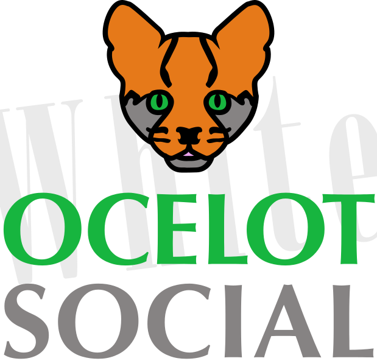

# ocelot.social

[](https://travis-ci.com/Human-Connection/Human-Connection)
[](https://codecov.io/gh/Human-Connection/Human-Connection/)
[](https://github.com/Human-Connection/Nitro-Backend/blob/backend/LICENSE.md)
[](https://discordapp.com/invite/DFSjPaX)
[](https://www.codetriage.com/human-connection/human-connection)

ocelot.social is a nonprofit social, action and knowledge network that connects information to action and promotes positive local and global change in all areas of life.

* **Social**: Interact with other people not just by commenting their posts, but by providing **Pro & Contra** arguments, give a **Versus** or ask them by integrated **Chat** or **Let's Talk**
* **Knowledge**: Read articles about interesting topics and find related posts in the **More Info** tab or by **Filtering** based on **Categories** and **Tagging** or by using the **Fulltext Search**.
* **Action**: Don't just read about how to make the world a better place, but come into **Action** by following provided suggestions on the **Action** tab provided by other people or **Organisations**.

 [](https://ocelot.social)

## Live demo

Try out our deployed [development environment](https://develop.human-connection.org/).

Logins:

| email | password | role |
| :--- | :--- | :--- |
| `user@example.org` | 1234 | user |
| `moderator@example.org` | 1234 | moderator |
| `admin@example.org` | 1234 | admin |

## Directory Layout

There are four important directories:
* [Backend](./backend) runs on the server and is a middleware between database and frontend
* [Frontend](./webapp) is a server-side-rendered and client-side-rendered web frontend
* [Deployment](./deployment) configuration for kubernetes
* [Cypress](./cypress) contains end-to-end tests and executable feature specifications

In order to setup the application and start to develop features you have to
setup **frontend** and **backend**.

There are two approaches:

1. Local installation, which means you have to take care of dependencies yourself
2. **Or** Install everything through docker which takes care of dependencies for you

## Installation

### Clone the Repository
Clone the repository, this will create a new folder called `Ocelot-Social`:

Using HTTPS:
```bash
$ git clone https://github.com/Ocelot-Social-Community/Ocelot-Social.git
```

Using SSH:
```bash
$ git clone git@github.com:Human-Connection/Human-Connection.git
```

Change into the new folder.

```bash
$ cd Ocelot-Social
```

### Docker Installation

Docker is a software development container tool that combines software and its dependencies into one standardized unit that contains everything needed to run it. This helps us to avoid problems with dependencies and makes installation easier.

#### General Installation of Docker

There are [sevaral ways to install Docker CE](https://docs.docker.com/install/) on your computer or server.

 * [install Docker Desktop on macOS](https://docs.docker.com/docker-for-mac/install/)
 * [install Docker Desktop on Windows](https://docs.docker.com/docker-for-windows/install/)
 * [install Docker CE on Linux](https://docs.docker.com/install/)

Check the correct Docker installation by checking the version before proceeding. E.g. we have the following versions:

```bash
$ docker --version
Docker version 18.09.2
$ docker-compose --version
docker-compose version 1.23.2
```

#### Start Ocelot-Social via Docker-Compose

For Development:
```bash
docker-compose up
```

For Production
```bash
docker-compose -f docker-compose.yml up
```

This will start all required docker containers

## Developer Chat

Join our friendly open-source community on [Discord](https://discordapp.com/invite/DFSjPaX) :heart_eyes_cat:
Just introduce yourself at `#introduce-yourself` and mention `@@Mentor` to get you onboard :neckbeard:
Check out the [contribution guideline](./CONTRIBUTING.md), too!

We give write permissions to every developer who asks for it. Just text us on
[Discord](https://discord.gg/6ub73U3).

## Technology Stack

* [VueJS](https://vuejs.org/)
* [NuxtJS](https://nuxtjs.org/)
* [GraphQL](https://graphql.org/)
* [NodeJS](https://nodejs.org/en/)
* [Neo4J](https://neo4j.com/)

## Attributions

Locale Icons made by [Freepik](http://www.freepik.com/) from [www.flaticon.com](https://www.flaticon.com/) is licensed by [CC 3.0 BY](http://creativecommons.org/licenses/by/3.0/).

Browser compatibility testing with [BrowserStack](https://www.browserstack.com/).


## License
See the [LICENSE](LICENSE.md) file for license rights and limitations (MIT).