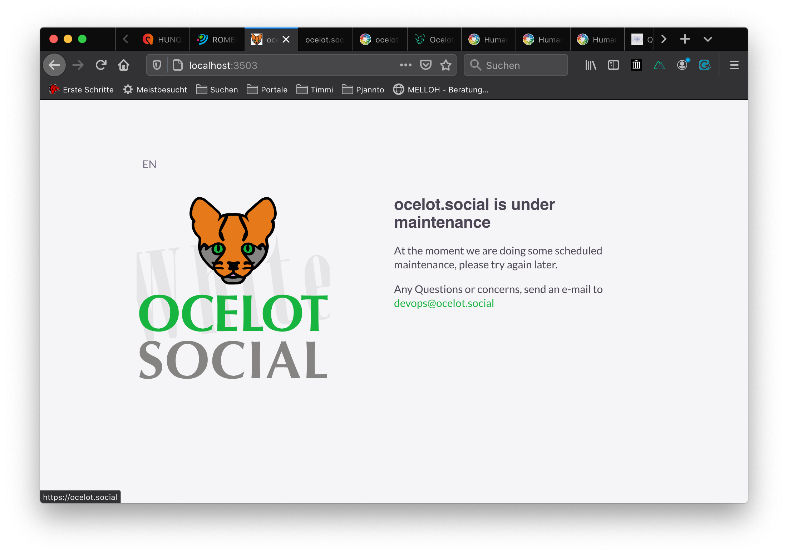

# Maintenance Mode

The maintenance mode shows a translatable page that tells the user that we are right back, because we are working on the server.



## Running The Maintenance Page Or Service

At the moment the maintenance mode can only be locally tested with Docker-Compose.





TODO: Implement a locally running maintenance mode! Without Docker …


The command …

```bash
# running the maintenance mode in webapp/ folder
$ yarn generate:maintenance
```

… is unfortunatelly **not(!)** working at the moment.
This is because the code is rewritten to be easy usable for Docker-Compose. Therefore we lost this possibility.




To get the maintenance mode running use the command:

```bash
# start Docker in the main folder
$ docker-compose up
````

And the maintenance mode page or service will be started as well in an own container.
In the browser you can reach it under `http://localhost:3001/`.
